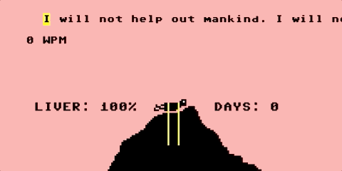
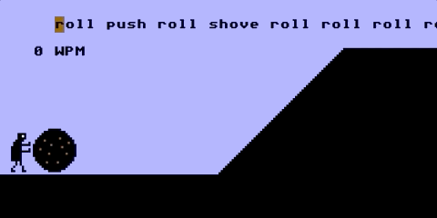
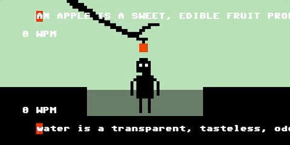
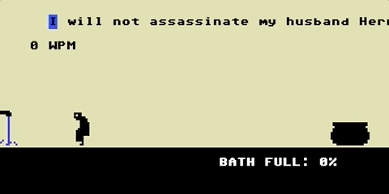
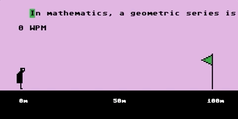
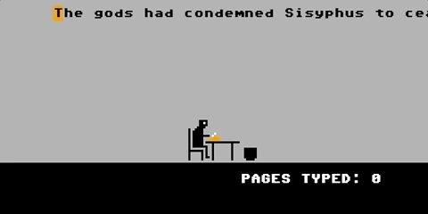

# _Let's Play: Ancient Greek Punishment: Teaches Typing_ Press Kit

#### [Play _Let's Play: Ancient Greek Punishment: Teaches Typing_](https://pippinbarr.github.io/lets-play-ancient-greek-punishment-teaches-typing)

## The basics

* Developer: [Pippin Barr](http://www.pippinbarr.com/)
* Release: 5 April 2019
* Platform: Browser (desktop only)
* Code repository: https://github.com/pippinbarr/lets-play-ancient-greek-punishment-teaches-typing
* Price: $0.00

## Who is this Pippin Barr guy?

Pippin is an experimental game developer who has made games about everything from [Eurovision](http://www.pippinbarr.com/2012/03/27/epic-sax-game/) to [performance art](http://www.pippinbarr.com/2011/09/14/the-artist-is-present/) to [dystopian post-work futures](http://www.pippinbarr.com/games/2017/07/03/it-is-as-if-you-were-doing-work.html). He's an Assistant Professor in the [Department of Design and Computation Arts](http://www.concordia.ca/finearts/design.html) at [Concordia University](http://www.concordia.ca/) in Montréal. He is also the director of the [Technoculture, Art, and Games (TAG)](http://tag.hexagram.ca/) Research Centre, which is part of the [Milieux Institute for Arts, Culture, and Technology](http://milieux.concordia.ca/).

## Description

_Type! Type the boulder up the hill! Type the eagle away from your liver! Type, damn you! It's Mavis Beacon Teaches Typing in the depths of Hades! Feel the burn of your repetitive strain injuries!_

---

_Let's Play: Ancient Greek Punishment: Teaches Typing_ is another edition in the _Let's Play: Ancient Greek Punishment_ series begun in 2011 and comprising: [Let's Play: Ancient Greek Punishment](http://www.pippinbarr.com/games/letsplayancientgreekpunishment/LetsPlayAncientGreekPunishment.html) (2011), [Let's Play: Ancient Greek Punishment: Art Edition Edition](http://www.pippinbarr.com/games/letsplayletsplayancientgreekpunishmentarteditionedition/) (2015), [Let's Play: Ancient Greek Punishment: Limited Edition](http://www.pippinbarr.com/games/letsplayancientgreekpunishmentlimitededition/) (2016), [Let's Play: Ancient Greek Punishment: CPU Edition](http://pippinbarr.github.io/letsplayancientgreekpunishmentcpuedition/) (2017), [Let's Play: Ancient Greek Punishment: Inversion Edition](https://pippinbarr.github.io/lets-play-ancient-greek-punishment-inversion-edition) (2019), [Let's Play: Ancient Greek Punishment: UI Edition](https://pippinbarr.github.io/lets-play-ancient-greek-punishment-ui-edition) (2019). In _Teaches Typing_ we return to the original style of pixel art but with the player's typing speed determining their interaction with the game. Typing quickly, consistently, and accurately enough allows them to proceed with the punishment in question, whether it's pushing a boulder uphill as Sisyphus or reaching for an apple as Tantalus. Each game has three difficulty levels which present different texts to type in. There's even a bonus Albert Camus level!

## History

The _Teaches Typing_ version came up essentially as part of my response to the birth of my son Felix. Once he was born I realised that I was fundamentally going to need game projects that would be fairly easy to conceptualise and execute, while still providing me with enough design interest to be worthwhile. I sat down and came up with around ten variations on the _Ancient Greek Punishment_ series, figuring that I could just spend the year making and remaking the "same game" over and over in different versions. So far so good! If you want some beard-stroking style meditations on the game and what it means, see the [process journal](https://github.com/pippinbarr/lets-play-ancient-greek-punishment-teaches-typing/blob/master/process/process-journal.md) or the [research questions](https://github.com/pippinbarr/lets-play-ancient-greek-punishment-teaches-typing/blob/master/process/research-questions.md).

_Let's Play: Ancient Greek Punishment: Teaches Typing_ is also a continuation of my project to apply the game development documentation approach I've been working on with my colleagues Rilla Khaled and Jonathan Lessard. We've come to call this approach the [MDMA](http://www.gamesasresearch.com/mdma) (for me it stands for _Method for Design Materialisation and Analysis_) and it forms a fundamental part of our [Games as Research](http://www.gamesasresearch.com/) project. So, if you want to, you can read a lot about the game's development by reading its [process documentation](https://github.com/pippinbarr/lets-play-ancient-greek-punishment-teaches-typing/blob/master/process/README.md) and by going through its [commit history](https://github.com/pippinbarr/lets-play-ancient-greek-punishment-teaches-typing/commits/master).

## Technology

_Let's Play: Ancient Greek Punishment: Teaches Typing_ was created in JavaScript using [Phaser 3](https://phaser.io/). The Advanced texts in the game come from Wikipedia. The text in the Camus level comes from Albert Camus's essay _The Myth of Sisyphus_.

_Let's Play: Ancient Greek Punishment: Teaches Typing_ is an open source game licensed under a [Creative Commons Attribution-NonCommercial 3.0 Unported License](http://creativecommons.org/licenses/by-nc/3.0/). You can obtain the source code from its [code repository](https://github.com/pippinbarr/lets-play-ancient-greek-punishment-teaches-typing) on GitHub.

## Features

- Typing!
- A lot of typing!
- Who knew you'd end up doing this much typing?!
- Repetitive strain injuries?!
- Punishment!
- Eternity!

### Trailer

See animated GIFs below, really.

## Images

## Press

- Nate Crowley, [Let's Play: Ancient Greek Punishment: Teaches Typing is as hellish as it sounds](https://www.rockpapershotgun.com/2019/04/05/lets-play-ancient-greek-punishment-teaches-typing-is-as-hellish-as-it-sounds/). Rock, Paper, Shotgun. 5 April 2019.
- [Ancient Greek Punishment: Teaches Typing – Browser Game](https://www.freegameplanet.com/ancient-greek-punishment-teaches-typing-browser-game/). Free Game Planet. 8 April 2019.

## Additional Links

- [Process documentation of _Let's Play: Ancient Greek Punishment: Teaches Typing](https://github.com/pippinbarr/lets-play-ancient-greek-punishment-teaches-typing/blob/master/process/README.md)
- [Commit history of _Let's Play: Ancient Greek Punishment: Teaches Typing](https://github.com/pippinbarr/lets-play-ancient-greek-punishment-teaches-typing/commits/master)
- [Let's Play: Ancient Greek Punishment](http://www.pippinbarr.com/games/letsplayancientgreekpunishment/LetsPlayAncientGreekPunishment.html) (2011)
- [Let's Play: Ancient Greek Punishment: Art Edition Edition](http://www.pippinbarr.com/games/letsplayletsplayancientgreekpunishmentarteditionedition/) (2015)
- [Let's Play: Ancient Greek Punishment: Limited Edition](http://www.pippinbarr.com/games/letsplayancientgreekpunishmentlimitededition/) (2016)
- [Let's Play: Ancient Greek Punishment: CPU Edition](http://pippinbarr.github.io/letsplayancientgreekpunishmentcpuedition/) (2017)
- [Let's Play: Ancient Greek Punishment: Inversion Edition](https://pippinbarr.github.io/lets-play-ancient-greek-punishment-inversion-edition) (2019)
- [Let's Play: Ancient Greek Punishment: UI Edition](https://pippinbarr.github.io/lets-play-ancient-greek-punishment-ui-edition) (2019)

## Credits

* Pippin Barr: basically everything?
* Jim and Mary Barr (aka my parents), David "Jhave" Johnston, Jess Rowan Marcotte: testing! Thanks!

## Contact

* Email: [pippin.barr+press@gmail.com](mailto:pippin.barr+press@gmail.com)
* Website: [www.pippinbarr.com](http://www.pippinbarr.com/)
* Twitter: [@pippinbarr](https://www.twitter.com/pippinbarr)
* Instagram: [@pippinbarr](https://www.instagram.com/pippinbarr)
* Facebook: [Pippin Barr](http://www.facebook.com/pippin.barr)
