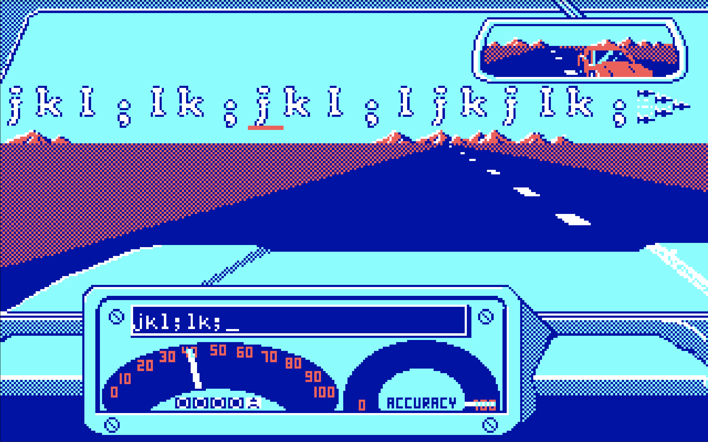
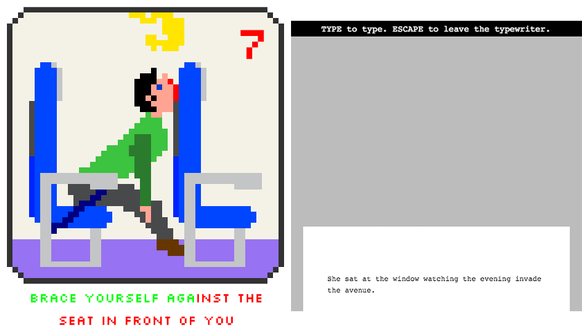
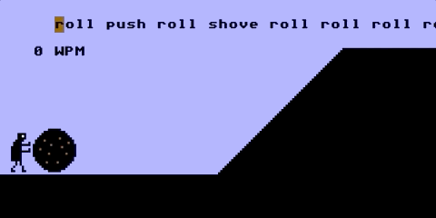
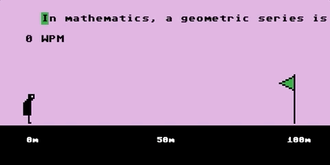

# What Would Mavis Beacon Do? Punish you.

_Let's Play: Ancient Greek Punishment: Teaches Typing_ is the seventh game in my _Ancient Greek Punishment_ series and the third "edition" this year (along with the [_Inversion Edition_](https://pippinbarr.github.io/lets-play-ancient-greek-punishment-inversion-edition/) and the [_UI Edition_](https://pippinbarr.github.io/lets-play-ancient-greek-punishment-ui-edition/)). While I used to create versions of the game every now and then, this year I've developed a real interest in _only_ making variations on this core theme for a while. As with past projects like [_PONGS_](http://www.pippinbarr.com/games/pongs/Pongs.html) and [_SNAKISMS_](https://pippinbarr.github.io/SNAKISMS/), I find a great deal of value in these sorts of [exercises in style](https://en.wikipedia.org/wiki/Exercises_in_Style). In particular, there's a real opportunity to think about _form_ rather than content, and so many of the games in the series allow for reflection on retelling the punishments in different interactive forms or with formal variation of the core rules of play, ultimately a kind of [research project](https://github.com/pippinbarr/lets-play-ancient-greek-punishment-teaches-typing/blob/master/process/research-questions.md#the-meta-question-of-cumulative-repetition-and-variation). (Note: throughout this text, I'll be linking chiefly to process materials generated as part of the project in its [code repository](https://github.com/pippinbarr/lets-play-ancient-greek-punishment-teaches-typing/tree/master/process).)

The key reference for _Teaches Typing_ is the educational software [_Mavis Beacon Teaches Typing_](https://en.wikipedia.org/wiki/Mavis_Beacon_Teaches_Typing), a touchstone from my childhood and the reason I can touch-type today. _Mavis Beacon_ has a particular mode in which your typing speed determines the driving speed of a racing car - I found it thrilling (make of that what you will). As such, _Teaches Typing_ adopts the central idea of typing representing your agency in a non-typing activity directly from _Mavis Beacon_: you type in order to carry out your punishment. _Mavis Beacon_ also lends the basic idea of the text you type scrolling in a single line at the top of the screen, and thus pretty much solves any addition user-interface design I might have grappled with. So the question became: [What Would Mavis Beacon Do?](https://github.com/pippinbarr/lets-play-ancient-greek-punishment-teaches-typing/blob/master/process/process-journal.md#what-would-mavis-beacon-do)

Working with a pre-existing game structure ([_Let's Play: Ancient Greek Punishment_](http://www.pippinbarr.com/games/letsplayancientgreekpunishment/LetsPlayAncientGreekPunishment.html)) and a pre-existing interface style (typing input and display as per _Mavis Beacon_) meant that I was left chiefly with the question of the meaning of the act of typing. I've worked on previous typing games in which the typing represented the actions being carried out ([_Safety Instructions_](http://www.pippinbarr.com/games/safetyinstructions/SafetyInstructions.html)) or quite literally represented _typing_ ([Eveline](http://www.pippinbarr.com/games/eveline/)). With _Teaches Typing_ I already had the actions defined (Sisyphus pushing a boulder, Prometheus struggling in his chains, etc.), so the question became how to position a [text](https://github.com/pippinbarr/lets-play-ancient-greek-punishment-teaches-typing/blob/master/process/research-questions.md#centrality-of-the-text) in relationship to that [agency](https://github.com/pippinbarr/lets-play-ancient-greek-punishment-teaches-typing/blob/master/process/research-questions.md#typing-as-expression-of-agency-and-narrative). Should the typing directly represent the action itself? Should it be about the punishment? Should it metaphorical represent the punishment? [What voice should the text use?](https://github.com/pippinbarr/lets-play-ancient-greek-punishment-teaches-typing/blob/master/process/process-journal.md#the-voice-and-person)

After spending considerable time [going back and forth on the "perfect" kind of typing activity to represent punishment](https://github.com/pippinbarr/lets-play-ancient-greek-punishment-teaches-typing/blob/master/process/process-journal.md#sisyphuss-advanced-text-mountaineering-thursday-7-march-2019-1122am) (such as an infinite [text generated with Markov chains](https://github.com/pippinbarr/lets-play-ancient-greek-punishment-teaches-typing/commit/eae52ff0e2039be8f1027d656daa4298d98727d7)), I realized that Mavis Beacon had the answer again: beginner, intermediate, and advanced levels of play that could each reflect different relationships between typing and myth. At the beginner level, the player would just type action words that represented the action being carried out, direct agency almost like button-presses. So Sisyphus requires typing "push" for instance, [very much in keeping with Mavis Beacon's simplest typing exercises](https://github.com/pippinbarr/lets-play-ancient-greek-punishment-teaches-typing/blob/master/process/process-journal.md#serious-text-design-exercise-with-a-happy-outcome-wednesday-6-march-2019-1616pm) (see also, commit [08bfb90](https://github.com/pippinbarr/lets-play-ancient-greek-punishment-teaches-typing/commit/08bfb907a0b09af05782e38165fa114622517fe3)). (Note: this worked well for very focused single-action punishments, but was somewhat complicated by the diversity of actions in Danaids.)

The intermediate level involves a focus on writing as a punishment in itself by taking on the form of "writing lines" as per Bart Simpson in the opening sequence of _The Simpsons_. In fact this [idea came from the students in my introductory programming course](https://github.com/pippinbarr/lets-play-ancient-greek-punishment-teaches-typing/blob/master/process/process-journal.md#more-text-thoughts-wednesday-6-march-2019-1328pm) at Concordia University, thanks everyone! The player writes an endless sequence of "I will not..." sentences, each of which refers back to the transgressions that led to the particular mythological character's torment in Hades. Prometheus writes "I will not steal fire" and "I will not help humanity", for example. This doubles back nicely to the "educational" mode of the game by giving the player some level of knowledge about these myths. (The Danaids version even "teaches" you the names of all 49 [murdered husbands of the Danaids](https://github.com/pippinbarr/lets-play-ancient-greek-punishment-teaches-typing/commit/bd6cfdac0f68c18d7775a72f65e0bfddc82bc807)!)

The advanced version of the game presented an opportunity to be a bit more associative. The advanced texts needed to be the most complex to type and I ended up selecting texts from Wikipedia. Here, though, the connection between text and punishment is more indirect: each text is an entry about the punished character's ["object of desire" or "object of opposition"](https://github.com/pippinbarr/lets-play-ancient-greek-punishment-teaches-typing/blob/master/process/process-journal.md#serious-text-design-exercise-with-a-happy-outcome-wednesday-6-march-2019-1616pm). Sisyphus involves typing the entry for [Hill](https://github.com/pippinbarr/lets-play-ancient-greek-punishment-teaches-typing/commit/f135efa22411e240c14347b1bdd3e9d0184ca3db), while the Danaids must write about [Bathing](https://github.com/pippinbarr/lets-play-ancient-greek-punishment-teaches-typing/commit/bd6cfdac0f68c18d7775a72f65e0bfddc82bc807) and Zeno must write about [Geometric Series](https://github.com/pippinbarr/lets-play-ancient-greek-punishment-teaches-typing/commit/4929ba81e74f1f812f264cc1cdc86909191d73c7).

The resulting game allows for a very different relationship to the myths from previous editions in the series. Prior to this the myths have formed a funny, but ultimately highly cartoonish foundation for hopeless interactions. With _Teaches Typing_, however, the textual focus allows a much "higher-resolution" examination of the punishments, their basis in myth, and their underlying meaning. As I sought to explore with _Eveline_, typing is also very much about _reading_, and reading presents the opportunity to examine the ideas underlying both the myths and the player actions associated with them.

And that's ultimately the huge value of pursuing these kinds of exercises in style: by cutting away the vast majority of design decisions, you're left to think that much more closely about what remains. That's right: Mavis Beacon belongs in the Greek Pantheon.
