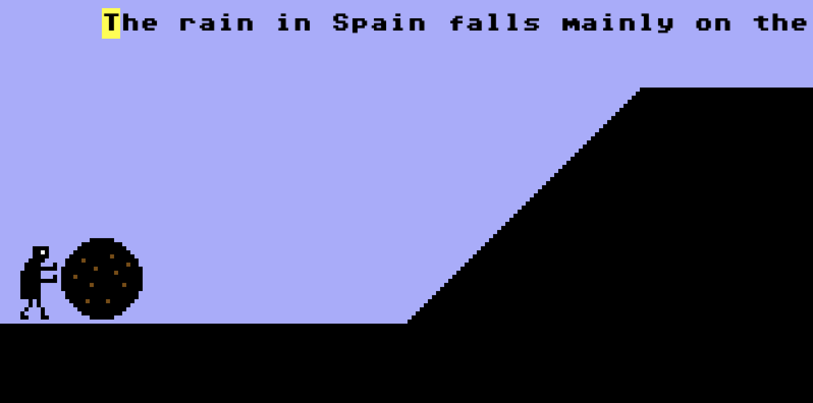
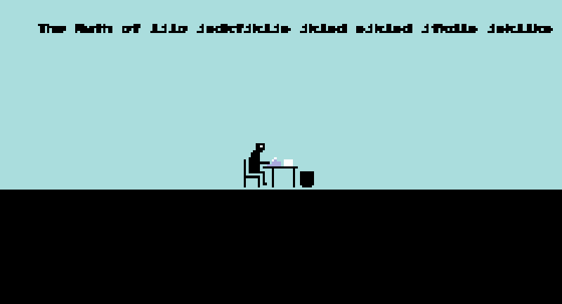

# The initial thinking (Tuesday, 26 February 2019, 15:03PM)

So as I start writing this all I can say is that I thought of the "Teaches Typing" extension to the "franchise" while in the bath, and didn't think more about it than the name. It just seems like a great candidate for a variation on the formula of the game, a classic mechanic to introduce, and a nice chance to revisit a typing game, which I haven't done since [Safety Instructions](http://www.pippinbarr.com/games/safetyinstructions/SafetyInstructions.html) in 2011.

## The obvious mechanic: discrete words

The most basic, and therefore probably not quite right, idea that jumps into my head is just to change the basic input from button-mashing to typing a specific verb that represents the action. So in Prometheus you type "STRUGGLE" and he struggles to dislodge the eagle once it's typed correctly. In Sisyphus you type "PUSH" and he pushes on the boulder. In Tantalus you type "APPLE"(?) And he reaches for the apple.

That would work and is certainly the easiest translation from one to the other. You could add some variance to it by having the word you're typing change, so "STRUGGLE" "WRITHE" "SQUIRM" "STRAIN" and so on. Synonyms. Could conceivably have tons of synonyms?

I think this would be a perfectly reasonable approach to the game, pretty basic, but reasonable. It matches the "teaches typing" mandate in that especially if you have multiple synonyms you can't get comfortable. It ties the typing directly to an action in a discrete way, which strikes me as good.

## Storytelling through continuous typing

Another route would be continuous typing rather than discrete words. In this case you'd need some kind of text that you're typing, and there are different candidates for this I guess...

- Retelling the myth itself by typing it out (repeatedly I suppose), potentially fairly elaborate, could be length.
- Typing out some kind of inner monologue of the character in question (something I did in the Nightmare Mode of Safety Instructions), a potential for comic writing etc. on my side, perhaps less "austere" than I could want
- Typing out something completely unrelated (that would be kiiiind of hilarious), or tangentially related, like a text about the physics of rolling, say, for Sisyphus, or the uses of fire by humans for Prometheus. There's something nice to that

In these kinds of cases I guess the point would be that for as long as you continuously and successfully type, the character would perform their action (Sisyphus pushes, Prometheus struggles, Danaids fetch water, etc.). This _wouldn't_ actually work for Tantalus, who has a choice of what he's going to reach for, but perhaps in that instance you could have two texts (one about apples and one about water).

There's an appeal to this mode because it allows for more expressive texts and thus more interest for the player in terms of performance. There's the issue that because it's non-discrete you're never really directly _enacting_ the struggle, but rather supporting it in an almost secondary way, providing fuel for the struggle or something.

## Discrete actions within storytelling?

One hybrid mode could be that you have a continuous text, but it's a text that contains regular synonyms for the action in question, either just jammed in there or actually integrated into the text or even weirdly replacing regular words in the text. This way the event in question would only happen when you complete typing the action word, and the rest of the typing it about reaching the next action word. They could be signified differently with colour or something to clarify.

But it's definitely a bit more complex than I immediately love.

## Thunder stealing from Oral Tradition?

Because I know I want to have an Oral Tradition Edition with voice recognition, I have a kind of competition over textual input (whether vocal or keyboard) that I have to be aware of. In the case of Oral Tradition it seems like I'll be asking these same questions, though in the context of what it makes sense to say. It could be that single words (possibly including synonyms) are going to make the most sense here because voice recognition isn't the most reliable and saying long sentences could be asking for trouble.

At any rate, I do need to be aware of that tension.

## What Would Mavis Beacon Do?

Obviously the "Teaches Typing" in the title comes from Mavis Beacon, so what do the levels look like in that software? What do you do? I remember a car racing game, but what was I actually typing while that was happening? Let's see...

> "Brazen gazelles quickly examined the forward jeep. The brown dog quickly jumped over the lazy fox. Will the kind judge squelch the five or six brazen nymphs?"   

- ([Let's Play Mavis Beacon Teaches Typing](https://www.youtube.com/watch?v=DQ3B1PUwr0I))

This sort of suggests that Mavis Beacon might even procedurally generate? Or at least has a bunch of phrases presumably designed to be difficult to type, distributed around the keyboard, and so forth. Importantly(?) the phrases are pretty nonsense-y and not connected to the context of a car race. So I guess nonsense is an option?

It's not very satisfying though, given that it kind of abdicates the connection between typing and action. Or rather, in Mavis Beacon it's just typing _speed_ that counts, not actually the thing you're typing which is arbitrary. Fair enough.

## So what do you want to try?

Well,

a) I can just implement a ton of the game without having to actually decide exactly what you're meant to be typing... the basic premise will be the same, type some predetermined text in order to perform the key actions.

b) I'm kind of into the idea of using the Mavis Beacon racing game as the core concept, which would mean having text "in the sky" that you're supposed to type.

c) I'm also therefore into the idea of a longer text rather than something brief, because of not wanting to steal the simpler idea from Oral Tradition, and because I think it creates more room for something to actually do while you play the game.

d) I suspect that if the text is semi-interesting to read as you type then maybe it's not even so bad if it doesn't have discrete actions? Another option though would be that each sentence is just some kind of generated expression of what you're doing? Using Tracery or something similar to create repetitious but varied statements of the action in question. "Push the boulder. Push on the boulder. Push the stone. Roll the stone. Resist the stone." etc. But that already looks pretty fucking boring.

e) Okay so is it that you type a continuous text and that the character just does its thing for as long as you maintain constant typing? Seems reasonable and is the most flexible in terms of the text. The simplest version is that ever n characters it performs the correct action where it's discrete (e.g. Prometheus) and otherwise some minimum wpm in order to maintain the effort required (all the others). Actually maybe just a minimum wpm for all of them, it's very Mavis, and for Prometheus the correct wpm represents continuous struggle.

f) What happens when you finish the text? It just starts up again? Should it be an entire novel's worth of stuff? Could I do some weird version of a novel where I replace a bunch of stuff to create a novel about the specific task in question? How hard would that actually be? Kind of funny concept.

g) Why am I writing this inane lettered list?

h) Well I guess the next step is to let this marinade and work on the technology side for a bit, then return to it.

## Here's what we're going to do

Each game is played by typing a longer text (unsure how long) and the action component is determined by maintaining a specific WPM as per Mavis Beacon.

To make this work I need to

- Implement the basic idea of typing as input
- Track WPM
- Cause the appropriate actions to start/pause based on WPM
- Figure out what kind of text will be the most fun thing to type in
- Work out what happens if you exhaust the text (if that's something possible)
- Markov chains on relevant texts to generate infinite fucked up texts about the myth in question???

---

# Sisyphus works; texts and difficulty; voice and person; wpm display; tantalus's two texts (Sunday, 3 March 2019, 14:21PM)

So at this point I've implemented a fairly playable version of Sisyphus in which you can type the words, they scroll by (infinitely), your WPM is recorded, and if it've above a threshold then the animation moves forward, if not you stop or lose your place.

## The texts? The difficulty levels?

Most obviously absent from this version is the text itself. Which is true for all the levels. And it's really does seem like this is the key 'design' question to be addressed here in a way. There's no major need to design the typing interface because we're just taking 'best practice' from Mavis Beacon.

An additional part here is if I'm having difficulty levels then I might want to have distinct texts per level, in part to make them actually more or less difficult, but perhaps also to reward higher level players with "better" texts?

A simple division

- Easy mode (low WPM) would have simple declarative sentences reflecting the specific action being taken. Could use Tracery to construct them so they're a bit more interesting/varied over time. Or could go all out and just have it be the exact same phrase over and over again.
- Normal mode (medium WPM) would maybe have an actual text (or Tracery) with actual sentences that maybe have more narrative content? Subclauses? Digressions about the emotions of the actions...?
- Hard mode (high WPM) would maybe where I could think about a Markov chain? Collect together multiple texts about the mythology in question and then Markov them for a series of sentences?
- Nightmare mode (ridiculous WPM?) would be what? The full text of Camus' essay? Is this necessary? Maybe I'll end up thinking of something. What about something as silly as "push push push push push" but with a really high WPM threshold?

## The voice and person

 - "I push the boulder." - The question of person is something here... I quite like first person now that I've written it.)
 - "Sisypus pushed the boulder." - A kind of narrator role which is sort of meta and amusin, not unlike a Stanley Parable feeling to it. (Which is, itself, kind of Sisyphean - though finite.)
 - "He pushed the boulder." - More impersonal (easier to type than 'Sisyphus')
 - "When pushing a boulder, it's best not to think too much about..." - Kind of situational, extending the story outward to other ideas
 - "Sisyphus wondered whether he was happy"

 A lot of this depends on the "sophistication" of the text, whether it's just declarative or actually a story or philosophy etc.

## Displaying the WPM?

Need to think about where to display the WPM and how to display the threshold? Something like '75/100 WPM'? And thus also '120/100 WPM' if above it. Or the WPM and the threshold separate beneath it? And for Tantalus with the two texts I guess just all the twice?

WPM could go green on success I guess, though it would break the pretty strict color palette the game has.

Should the WPM be attached to the figure of the character? So moving through the space with them? Or more just diagnostic.

Where does Mavis display it? In the car race it's displayed as the odometer on the car of course. So it's very in world. In the more banal typing experiences it's expressed at the end of the lesson rather than live during play.

So for now I think more of a traditional style?

How will this end up conflicting with/fighting for space with the other textual elements from the original game(s) like the stats I display in each case? Tricky tricky. Will just have to see.

## Tantalus's two texts

Tantalus is the one level where you need to be able to choose between two options (apple versus water). And therefore there need to be two texts, one of which you type to reach up and one of which you type to reach down. Which is fine, but - how do you police which one is being typed? Specifically, what happens if the texts end up aligned (for a single letter or more) at some point (which will absolutely happen). In this case the default behaviour of the code right now would be that both texts would advance, and then you wouldn't really be able to choose which option to opt for? Or rather, I guess it would still work because a single character (or two) isn't enough to raise the WPM high enough for the threshold, but even so you don't really want the incorrect text to even move?

One option is just "oh well" and you leave it alone. Assuming you don't get too much lining up, it shouldn't affect the gameplay itself, it would just be visually displeasing because you wouldn't have intended to enter a character into the other text, but still I guess you did.

Another option would be that you choose which one you're typing before you start typing it, through some kind of selection option. But this seems like it immediately introduces a gross amount of UI that isn't really very nice to think about.

Another option would be that the "selected" text alternates on its own and only sticks if you start typing (WPM > 0). If your WPM hits zero it goes back to alternating. But again there feels like there's no reason for this and it requires extra UI and thus thinking by the player.

Another option would be that a text only really starts scrolling if you type three or more characters in a row correctly? This would be a bit arbitrary but would at least allow you to type the one you intended a bit more intelligently. Maybe during that initial phase before it's "chosen" it highlights the characters and then, once you've locked into one, it starts the scrolling, but then subsides if you hit 0 WPM and reperforms the trick. It's still extra UI but it might make sense.

So there's a definite issue here and a decision has to be made. Those are the solutions I can imagine for now.

---

# More text thoughts (Wednesday, 6 March 2019, 13:28PM)

Spoke to my programming class about the project yesterday to solicit some thoughts from them on what kinds of text there could be. Main suggestions:

- Some kind of __internal monologue__. Allows a kind of access to the experience of the situation, also potentially a greater range of ideas and tangents, brings the player closer to the character perhaps.
- Something __factual__, reporting on the myth itself from something like Wikipedia or similar. A distanced perspective. A punishment for the player because it's boring/dry?
- Something __about the things the character is being punished for__ rather than the punishment. Hadn't really thought of this. Sisyphus is being punished because he plotted to kill his brother, perhaps killed his guests, etc. So this would be a way of reliving the crimes committed that led to the punishment meted out.
- A form could be like the __punishment lines written out on a blackboard__. "I will not seduce my niece. I will not murder travellers. I will not plot the murder of my brother." Etc. Could be a funny option for the middle difficulty. Has an infinity built into it. Kind of weird/amusing to have to write something like this for Zeno, who isn't technically one of the myths.

Seems to me that the punishment on the blackboard is funny for either the basic version or the medium. The most basic version could perhaps be fairly literal instructions (maybe with Tracery) concerning performing the action involved. "Push the boulder. Push the rock. Push.". Then the middle one can be punishment on the blackboard with reference to history. The hard one can be... well I don't know, maybe that's an opportunity for Markov chaining surreality?

In which case I'm a little bit ready to produce a proper Sisyphus I suppose.

Plus I suppose I have to think about menu systems in light of needing to to select difficulties. Shouldn't be so hard though.

Hades hades hades. Suck bite suck bite.

---

# Serious text design exercise with a happy outcome (Wednesday, 6 March 2019, 16:16PM)

Still puzzling over the texts. I've now produced attempts for each of the three levels:

__Beginner__ involves a Tracery that builds simple descriptions of the action in question, like "Slowly push the boulder up the hill" and variations. I worry that these are kind of overkill for this easy level and that it might be more effective/interesting to have it be a single word over and over like "push" as a funny use of typing in this simplest case.

__Intermediate__ involves a Tracery that builds "I will not..." sentences that reference the misdeeds of the character in question. It's pretty effective and even kind of educational to learn about what the person did rather than fixating on the symbolism of their punishment, so quite like that about this. I guess it's my favorite. On the other hand I do have a concern that outside Sisyphus there may not be enough material for it. Sisyphus did so much shit and is so famous, I'm worried the others might not live up to it. But it should be okay?

__Advanced__ currently involves literally typing in Camus's essay about Sisyphus (just the little section of it called The Myth of Sisyphus actually). I experimented with a Markov Chain variation too, which leads to sort of nonsense-y stuff which, I mean I guess it's fine. However I'm concerned because... Camus didn't write an essay about every mythological punishment just this one, so it's too special a case I imagine. (Now I wonder... what about a final unlockable where you get to be Camus just writing the Sisyphus myth over and over on a type-writer? Ha ha? Maybe I like this. - MDMA-wise by the way, this literally just came up - mostly at the thought of discarding Camus from the way I'd understood the game, but wanting to conserve him.)

So you can see I have some concerns. But I also have relatively okay solutions?

- __Beginner__ can be a single word like "push" I think. Or maybe 10 of push and then 10 of shove and 10 of roll etc. That will actually look quite Mavis Beacon-y!! push shove roll shove shove roll shove roll push push push. Hmm! Nice word bra.

- __Intermediate__ is pretty cool and I'll try to have faith I can preserve the same idea for the other myths.

- __Advanced__ is a bit broken, but my key insight here is, I think, the idea that what you're typing in is about what you're trying to do. I may have mentioned this elsewhere or it may have just been a fever dream in the bathtub, but I think there's something to this. So Tantalus has texts about apples and water. Zeno has texts about... finish lines? Races won? Flags? Ha ha. Sisyphus has texts about... the tops of hills??? Prometheus has texts about breaking free of chains? Escape artists? Heh heh heh. Fuck yeah. Danaids have texts about baths. So I mean, this is pretty fucking good. Just a question of where these texts come from. Whether it's some kind of iconic text you type over and over. Or is it literally a Wikipedia entry? Or is it something else?

- __Nightmare__ could be being Albert Camus writing the Myth of Sisyphus. Maybe you write the whole thing out, and then the page blows away, or it gets stolen, or burned, and so you have to start again? I mean, yeah that's fucking good. And then it could be greyed out at the bottom of the screen until you've tried all levels at beginner or something? Oh yeah. This is a thing. This is a happening thing. Or maybe you have to play Sisyphus as all three levels to unlock Camus. Ah that's fun.

Okay, this was a good talk we had you and I.

---

# Sisyphus's advanced text? Mountaineering? (Thursday, 7 March 2019, 11:22AM)

Just sat down with Sisyphus and changed his beginner text (now it's just like push roll shove shove roll roll shove push push etc.).

Then I was going to "just do" his advanced text, but ran into various issues that I discussed with Rilla and just want to list here so I have a record of the thinking process.

- If it's going to be Markoved then I need a significant body of text, and would need to be okay with some nonsense-y stuff, which I'm not 100% sure I am. Markov could work if I had something like an entire novel about mountain-climbing or something. But even then it wouldn't be so ideal because many/most of the sentences produced wouldn't necessary lock into the core ideas.
- This makes me think non-Markov might be better, but if non-Markov then I run into the issue (if it is one) of a potentially non-infinite text. If it's, say, a Wikipedia entry on mountains, then that's linear and has an end. The obvious thing is that you reach the end and begin typing it out again, and it's possible that's fine (and it's possible nobody would ever type the whole stupid thing in and so the problem would never be encountered - but that's not how we roll).
- The point of the text (going with the ideas for the other characters) has been some kind of technical/factual text about the object of obsession/torment I suppose. Or alternatively the goal. If obsession/torment then the boulder becomes plauisble as a topic of interest. If the goal, then I guess something like "successful mountain ascents" is a thing. Wikipedia has the stats on successful ascents of Everest for instance, so you could imagine doing something with that? Stats on successful ascents of the big seven mountains or something? Very, very dry texts that would be, and maybe not as interesting to type.
- A text on Everest or some other mountain as symbolic of Sisyphus's task, referencing the idea of people using Everest as a metaphor for a difficult or quasi-impossible task? Everest has a very substantial Wikipedia entry for the record. Is it kind of too specific to a particular mountain though?
- Mountain Climbing as an idea? Because mountain climbing is about reaching the top? "Mountaineering" has a major entry in Wikipedia.
- Think we're getting somewhere. Maybe I start with Mountaineering and see how that feels.
- (Note this is mostly "just" problematic for Sisyphus - I think I have some good leads for the others.)

---

# Post-Sisyphus, How Do You Do Camus? (Monday, 11 March 2019, 14:33PM)

## Post-Sisyphus

At this stage I have what I think is a fully implemented Sisyphus barring some tweaks here and there. And thus I have kind of the model for the other levels, all of which have exactly the same mechanics as Sisyphus and so 'just' need to be put together in the same way.

In the end with Sisyphus I went with "hill" as the kind of object he's obsessed with. The only issue with it (and with this idea in general) is the non-infinite nature of the text in question. So that when you finish the text it will just cycle around. Which I suppose is fine in the end, but just has this very slight catch of not being clever enough? Even though there's a very real sense in which it's totally representative of the punishment - you 'finish' the task only to find that the task must be repeated anyway.

Anyway this leaves me with a straight shot for the rest of them except...

## How Do You Do Camus?

So there's this idea of a special mode unlocked by playing Sisyphus where you get a Camus mode. In that mode it would be something like

- Scene of Camus (the usual representation of a character from this world) sitting at a typewriter (I guess it has to be side-on)
- The text to type at the top is just Camus's essay The Myth of Sisyphus
- There is the sound of typing as you type obviously, and some kind of simple animation if it makes sense
- In terms of endings you either:
  - Type in the full essay and it begins again (kind of boring)
  - Type but whenever you make a mistake the whole thing gets reset (kind of funny to literally blame it on the player - could overlay the incorrect character so it's clear that you fucked it up?)
  - Type but at some point there's an actual mistake in the text you're supposed to type, which you then type in because you have to, but which causes failure
- In the two 'failed' cases we need some way to indicate that the mistake (or 'mistake') requires Camus to start the essay over from the beginning (and note that in the case where the play can make a mistake of their own you'd still need to account for a perfect run, in which case they win? or it just repeats?)
- Does it need to be on a typewriter? I guess it does for the sense of permanence
- If it's the user-error then it seems like it would be pretty funny to let them "win", but perhaps to introduce a minimum WPM they have to type the whole text in (100WPM say). So it's possible to do it but incredibly hard? Or even just 80? Or perhaps no need for a limit like that actually.
- Okay I'm sold on the user-error one. So you have to type the entire essay perfectly, but at whatever speed you like. And if you finish you win.
- If you make a mistake he should tear the paper out of the typewriter and throw it away? How do you indicate it's a failure?
- Definitely need a little arm raise celebration when he finishes!
- Quite probably to solve the 'what does it look like on failure I'll need to draw it up a bit eh

---

# Camus sketch (Monday, 11 March 2019, 15:18PM)

Spent a tiny bit of time mocking this up and it allowed me to think through how a bunch of things might look. It's kind of important not to get too caught up in fancy animations given the tiny number of people who will bother with this so my thought is

- Hands move while typing, typing sounds
- At a certain word count (300 or so) you get a "page complete!" notification, and the pile of pages to the right of the typewriter increases (but this wouldn't be every time because they're so thick). In fact there can just be a "pages written" bit somewhere to deal with that. So long as the player realises they are accumulating pages.
- When there's a mistake the bad sound plays and then the stack of paper is shifted to the trash, which can literally be tweening stuff I think, and making sure the trash can hide/take any size of paper
- When there's a mistake I guess you need to "add" the most recent page to the pile? Nah, probably not, unless there's only one page (they haven't finished a page) in which case we should add one to the pile first, then trash it.
- And that's it
- Plus the victory arms if he finishes
- The swoop down as the pages go into the trash, and then the text resets for you to start all over again

I think that'll work.

---

# Prometheus and Zeno and the future (Monday, 25 March 2019, 17:30PM)

Post Sisyphus I went ahead and did Prometheus. His advanced text is about Escapology which I quite enjoy. And Zeno is underway without too much trouble, with an advanced text about Geometric Series (aka a potential mathematical refutation of his Paradox, oh the irony). Basically the game is pretty satisfying at this point and the differentiation between the three levels works really well in my opinion, definitely well enough. Maybe the only vague sticking point is just the current default action of repeating the advanced text after it ends which isn't quiiiiiite perfectly satisfying, though I think I'd arguing it's totally good enough (not least because I'm going to go ahead and assume zero people will type a full advanced text into the game). Plus at a fundamental level the text repeating is just like the punishment. I guess I'm just saying I wish I had some next-level interactive joke to handle that scenario? Maybe there is one and maybe I'll think of it.

Overall it's progressing smoothly, and I feel like I'm using Phaser better than ever (tweens have become a major thing along with use of callbacks to facilitate much smoother code). No problems foreseen with Zeno nor any of the others and just Camus as brand new code to write at some point. Once it's done it's done. Very very outside chance I could finish this month? Potentially I  could finish the game but release in April? Something like that. And: whatever. I could probably finish and release two or three in April in that case?

This is kind of boring for "process", but it's just going fine and this is definitely one of the least redesign-y versions of the game, so it's not surprising there aren't buckets of design insight.

---

# "Finished" (Saturday, 30 March 2019, 15:14PM)

Wow I guess I've been doing this faster than I thought. We're here (less than 6 days later) and I've finished Zeno, Daniads, Tantalus, and Camus. I mean, that's in no small part because it isn't actually very complex to produce each level after I set the specific 'tone' with Sisyphus. Most of the programming thinking was done.

With the exception of Camus, which has a different structure which I'm pretty happy with all told.

- You're typing the famous essay
- If you make a single error, he hangs his head and all the pages are swept into the trash
- If you finish the entire essay, he raises his arms in victory, but then the pages are swept into the trash, and he droops, then begins the whole essay again

I'm really quite happy with that, it has some good comic timing involved, and is a funny 'reward' for anyone who bothers to type in the entire Camus essay (also known as: nobody).

In the end I think all the levels are pretty strong reimaginings of the original game in the context of typing. I'm pleased with the different difficulty level text selections overall, though I'll want to do at least one more pass through them before releasing it properly. The advanced texts are perfect, I think, it's just beginner and intermediate that need some work.

I might jump over to research questions to see if I have any thoughts about that...
